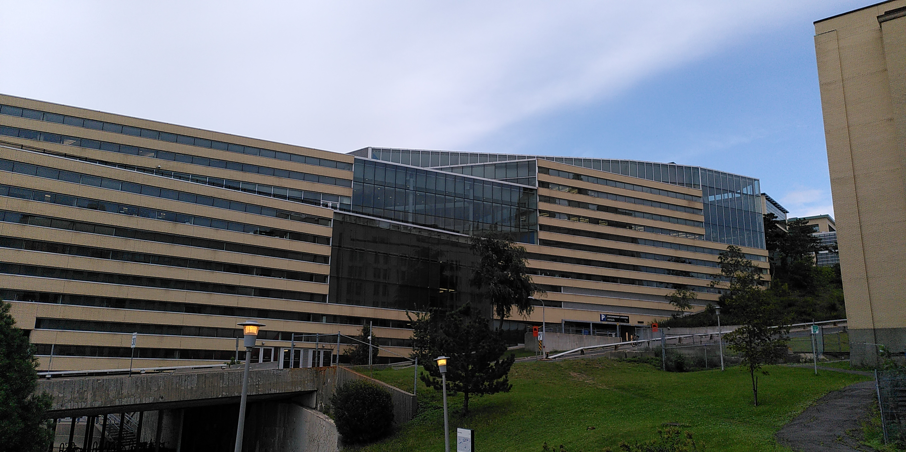
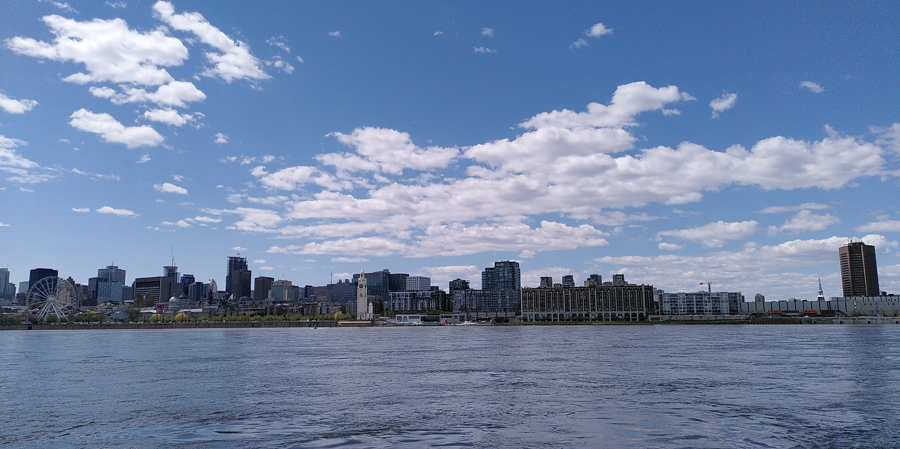
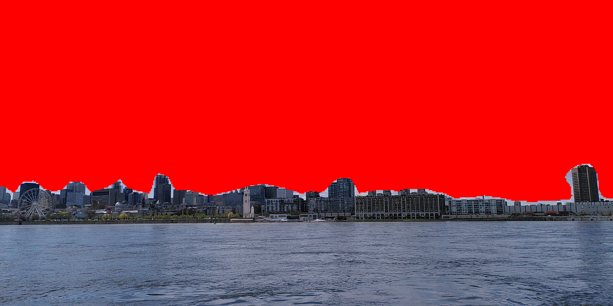

# Sky detection - deep learning approach

The follow repository contains a first approach to segment the sky from  RGB pictures.
It proposes a neural based solution in order to apply semantic segmentation in order to separate the sky from the rest of the input picture

**Authors**: Pierre-Emmanuel Rebours, pierre.emm.rebours@gmail.com

## Context

The follow proposition has been made for a technical test for a job opening. It has been realised on a local machine with the follow **configuration**:
- **OS:** Windows 10
- **CPU:** Intel(R) Core(TM) i5-8400 CPU @ 2.80GHz   2.81 GHz
- **GPU:** NVIDIA GeForce GTX 1060 3GB

## Requirements

The requirements are indicated into `requirements.txt`. With pip:
```bash
pip install -r `requirements.txt`
```
The follow code has been developed and test with Python 3.11.9
You can download the train model at the follow [link](https://drive.google.com/file/d/1jC3rfhn1ANDZa1LhS2PkrRz2abkB8V_k/view?usp=sharing). Then, put the file `fcn_resnet50.pt` in the `runs` folder.


## Presentation of the solution

The semantic segmentation is realised with a FCN (Fully Convolutional Networks) as the one presented by [1]. But contrary to the article, we will use a ResNet50 backbone for the encoder part.

### Why FCN-ResNet50 ?

Semantic segmentation has further important models that could give very good prediction when theye are well train like DeepLabV3+ or Transfomers based approach.
But, in the context of the project, I was limited by local ressources (my local machine with one GPU with 3GB) but also time for learning.
Futhermore, sky segmentation is not a too complex task compare to others so there is not necessarily the need of complexe models like Tranformers to archieve good results.
In addition, the model should be run for real-time inference.
FCN was an appropriate solution because, even if it give less precision than model like deeplabv3+, its performance is not too bad, it is faster in runtime and it can be train fastly.
The FCN is composed with a pretrained ResNet50 backbone in order to make training easier and to allow the FCN to capture deeper festures.

### Dataset: Cityscapes

To train and test the model, Cityscapes dataset has been used. It contains frames from video sequences taken during driving in stret scenes in 50 different cities. The video sequences have bene taken with different daytime, season or weather.
There are 5000 frames with precised annotations and 20 000 annoted frames with weakly annotationd. Only the precised annotations have been used for training.
This dataset has been choose because it contains outdoor images and so, it include sky in its labels.
Because the dataset contains only urban scenes, the follow project focus more on sky segmentation in urban environment.

There are maybe better dataset which focus on sky detection in diffenent scenes, but this one has the advantage to be easily manipulated on my local machine.

Cityscapes can be download on the [official website](https://www.cityscapes-dataset.com/). It must be put into the folder `data` and respect the follow hierarchy:

    cityscapes
    ├── gtFine
    │   ├── train
    │   │   ├── zurich
    │   │   │   ├──zurich_000000_000019_gtFine_color.png
    │   │   │   └── ...
    │   │   └── ...
    │   ├── val
    │   └── test
    ├── leftImg8bit                  
    │   ├── train
    │   │   ├── zurich
    │   │   │   ├──zurich_000000_000019_leftImg8bit.png
    │   │   │   └── ...
    │   │   └── ...          
    │   ├── val         
    │   └── test                
    └── ...

> [!WARNING]
> The official test split groundtruth of Cityscapes is not publicly available (to avoid overfitting). To get a test set, the official validation set has been separated into two.
> So, the used validation set is composed of the sequence  `frankfurt` and the test set is composed of `lindau` and `munster`.

### Training process

You can download the train model at the follow [link](https://drive.google.com/file/d/1jC3rfhn1ANDZa1LhS2PkrRz2abkB8V_k/view?usp=sharing). Then, put the file `fcn_resnet50.pt` in the `runs` folder.
The model `runs/fcn_resnet50.pt` has been train on the training set for 10 epochs, with Adam optimizer, with a learning rate of 1e-05.
It has been train with random data augmentation including color jitter (random change in brightness, contrast, saturation and hue), auto-contrast, horizontal flip, random cropping.
The log of the training process is `log/log.txt`.

## Training

The code `train.py` execute the training process and require, as arguments, a .yaml configuration file. The file `config/config.yaml` show the configuration use to train the model on my local computer.
To reproduce the training, you can execute the follow command line in the project repository:

```bash
python train.py --config_path="config/config.yaml"
```

Note that, in the config file, because of limited memory, the imaged size for training is reduced.

## Test

The code `test.py` execute the evaluation on the test set. It requires at least as argument the path to the train model to evaluate and the path to the training configuration file.
It returns, as output, metrics distribution curve and violinplot on .png files and metrics value on a .txt files. It computes: computation time (ms), accuracy, IoU, precision, recall, f1_score
To evaluate the train model given in this repository, you can execute the follow command line in the project repository:

```bash
python test.py --model_path="runs/fcn_resnet50.pt" --config_path="config/config.yaml"
```

The evaluation results are saved in the folder `output/evaluation`.

##  Inference

The code `inference.py` allow to apply the model on different kind of output. You can get the segmentation of an image in `.png`,`.jpg` or a video in `.mp4`.
You can also run the code in real-time with your own camera or other video source. if inference is not executed fo real-time display, the generated output is saved in `output/inference`
To run inference on a sample video, you can execute the follow command line in the project repository:

```bash
python inference.py --model_path="runs/fcn_resnet50.pt" --config_path="config/config.yaml" --input="sample/video.mp4"
```

To run inference on your own video source in real time, you can execute the follow command line in the project repository:

```bash
python inference.py --model_path="runs/fcn_resnet50.pt" --config_path="config/config.yaml" --input="your/video/source" --real_time
```

The source can simply be a camera index (0 for default camera), a video stream url, or a file.

If you run the follow command in the project repository, it should process the output of your default camera in real-time:

```bash
python inference.py --model_path="runs/fcn_resnet50.pt" --config_path="config/config.yaml"
```

## Results

To see all evaluation plots, see `output/evaluation` folder. Some qualitative results are shown in `output/inference`.
`output/inference/video.mp4` is the result of the applciation of the model on a sequence of Cityscapes. The three example images does not come from the dataset (home-made).

Metric value for the test split (233 images):
<table align="center">

|  Metric         | mean  | std |
| :--------        | :-------------: | :----:   | 
| Accuracy  | 0.996       |  0.007     | 
| Computation time (s)  | 0.0134      |  0.0147      | 

</table>


<table>
<tr><th>For label 'Sky' (positive class)</th><th>For label 'Other' (negative class)</th></tr>
<tr><td>

|  Metric  | mean  | std |
| :--------        | :-------------: | :----:   | 
| IoU  | 0.789      |  0.183     | 
| Precision | 0.921      |  0.085      |
| Recall | 0.838      |  0.187      | 
| F1_score | 0.866      |  0.163     | 

</td><td>

|  Metric     | mean  | std |
| :--------        | :-------------: | :----:   | 
| IoU  | 0.995       |  0.004     | 
| Precision | 0.997      |  0.002      |
| Recall | 0.998      |  0.002     | 
| F1_score | 0.998      |  0.002     | 

</td></tr> </table>


|  Metric  (for label 'Sky')       | mean  | std |
| :--------        | :-------------: | :----:   | 
| IoU  | 0.789      |  0.183     | 
| Precision | 0.921      |  0.085      |
| Recall | 0.838      |  0.187      | 
| F1_score | 0.866      |  0.163     | 

|  Metric  (for label 'Other')       | mean  | std |
| :--------        | :-------------: | :----:   | 
| IoU  | 0.995       |  0.004     | 
| Precision | 0.997      |  0.002      |
| Recall | 0.998      |  0.002     | 
| F1_score | 0.998      |  0.002     | 


### Qualitative results on random image (outside Cityscapes)

<div align="center">



</div>
<div align="center">



</div>


## Perspective

This approach has limitations. First, because I have to work with limited ressources, I have to reduce the input size to train the model and so, the model lose in precision because it cannot process fine details.

Then, if Cityscapes is a good dataset, it focus only on urban scenes. And so, the model give better performances for urban outdoor scenes. Finding datasets with more various outdoor scenes could improve the generalizability of the model. SkyFinder is a dataset that focus on task like sky detection [2]. It contains outputs of 53 fixed camera in various scenes, with various time,weather an season conditions. It represents approximately 100 000 images. But the fact that the camera is fixed implies that there are not a lot of change in the scenes geometries. Geometrical data augmentation transformrs are required. I started to implement the dataset to load it in  `utils/dataset.py`.

About the computation time, the model run fast and real-time execution is possible. But the inference code `inference.py` could be computed fastly. The problem relies in particular on memory moves between cpu and gpu. A full computaion on gpu is preferable. TensorRT could also improve computation time over PyTorch.


## Reference

[1] [Fully Convolutional Networks for Semantic Segmentation](https://arxiv.org/abs/1411.4038)

[2] [Sky segmentation in the wild: An empirical study](https://ieeexplore.ieee.org/document/7477637)